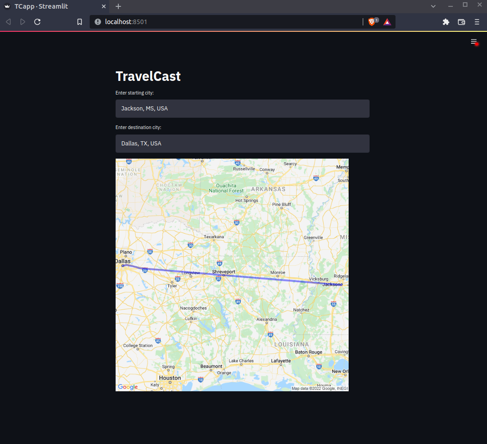

# travelcastpy

- This is a simple app to map weather forecast data from the Open Weather Map API with route information provided by Google Maps. 
- This project may be of interest to those interested in the weather along the route of over time.
- Here's a screenshot:
   
   
   
